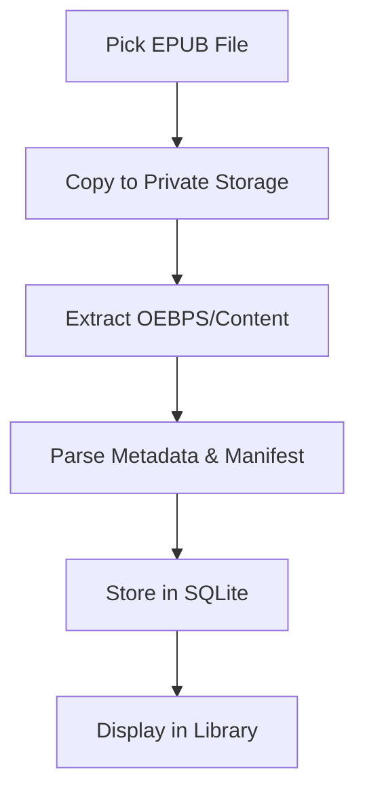

# Open Page 📖

Open Page is a modern, high-performance EPUB reader built with Flutter. It focuses on a clean reading experience, robust persistence, and seamless cross-platform performance.

## 🚀 Features

- **Responsive Library**: Manage your book collection with automatic metadata extraction.
- **High-Fidelity Rendering**: HTML5/CSS3 rendering via WebView for accurate book layouts.
- **Smart Persistence**: Remembers your exact reading position (scroll percentage) and last-read chapter per book.
- **Global & Local Settings**: Customize themes (Light, Dark, Sepia), font sizes, and margins. Defaults can be set globally or overridden per book.
- **Blazing Fast**: Uses efficient local extraction and SQLite for lightning-fast performance even with large libraries.

## 🏗️ Architecture

Open Page follows a clean, modular architecture:

- **State Management**: Powered by [Riverpod](https://riverpod.dev/).
- **Storage**: 
  - [sqflite](https://pub.dev/packages/sqflite) for structured data (Books, Bookmarks).
  - [shared_preferences](https://pub.dev/packages/shared_preferences) for UI settings.
- **EPUB Pipeline**: Uses [epubx](https://pub.dev/packages/epubx) for parsing and a custom extraction engine to handle local file access efficiently.

### EPUB Processing Pipeline



## 🛠️ Rendering Approach

Unlike simple text-parsing readers, Open Page renders the original HTML/CSS of the EPUB.

1. **Extraction**: EPUB files are extracted to a private directory to bypass WebView's origin restrictions on different platforms.
2. **CSS Injection**: Custom styling (themes, fonts) is injected via JavaScript at runtime, allowing for instant updates without reloading the view.
3. **JS-to-Flutter Bridge**: Scroll positions are captured via a JavaScript bridge, ensuring that the exact reading progress is saved in real-time.

## 📦 Getting Started

### Prerequisites

- Flutter SDK (Latest Stable)
- Android Studio / Xcode (for mobile)
- Linux/MacOS/Windows C++ Toolchain (for desktop)

### Installation

1. Clone the repository:
   ```bash
   git clone https://github.com/abhish3k-397/OpenPage.git
   ```
2. Install dependencies:
   ```bash
   flutter pub get
   ```
3. Run the application:
   ```bash
   flutter run
   ```

## 📄 License

This project is licensed under the MIT License - see the LICENSE file for details.
